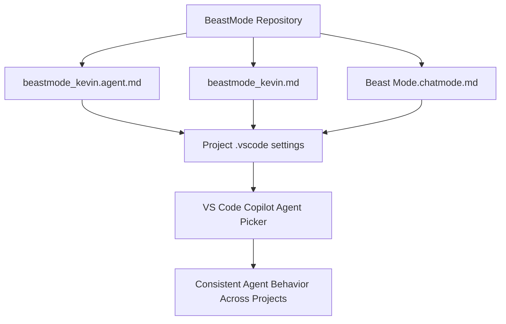
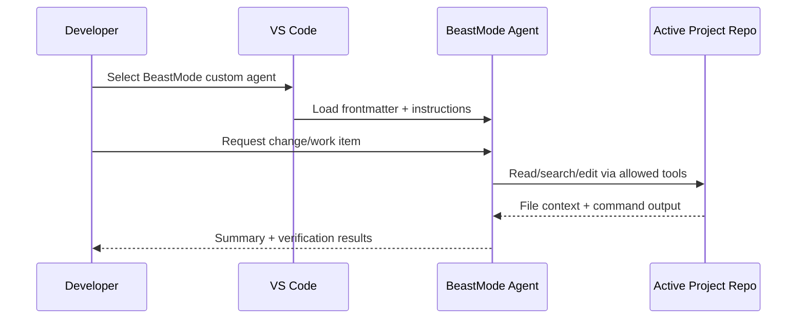
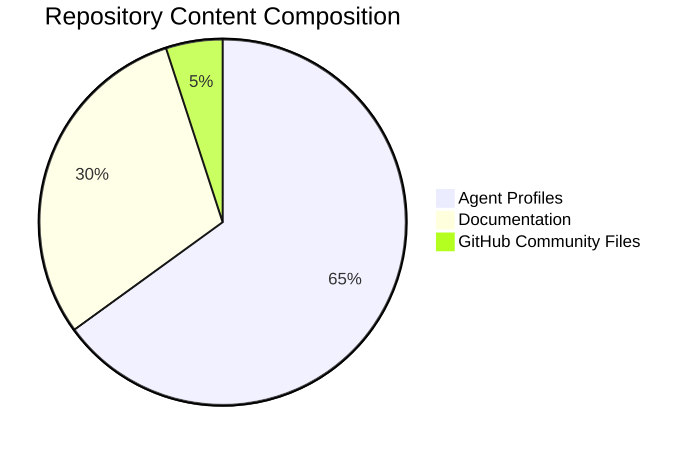
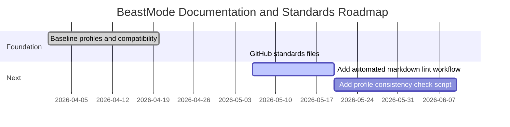

<a id="top"></a>

<div align="center">
  <h1>BeastMode</h1>
  <p><em>A reusable, high-autonomy custom agent profile pack for VS Code Copilot workflows.</em></p>
</div>

[](LICENSE)
[](https://github.com/hkevin01/BeastMode/stargazers)
[](https://github.com/hkevin01/BeastMode/network)
[](https://github.com/hkevin01/BeastMode/commits/main)
[](https://github.com/hkevin01/BeastMode)
[](https://github.com/hkevin01/BeastMode/issues)
[](https://www.markdownguide.org/)

## Table of Contents
- [Overview](#overview)
- [Key Features](#key-features)
- [Repository Layout](#repository-layout)
- [Architecture](#architecture)
- [Usage Flow](#usage-flow)
- [Technology Stack](#technology-stack)
- [Setup and Installation](#setup-and-installation)
- [Using BeastMode Across Projects](#using-beastmode-across-projects)
- [Development Status](#development-status)
- [Roadmap](#roadmap)
- [Contributing](#contributing)
- [Security](#security)
- [License](#license)

## Overview

BeastMode is a repository of custom agent definitions and instruction profiles for VS Code Copilot workflows. The project focuses on operational consistency: one shared Beast Mode profile, discoverable from many workspaces, with explicit behavior rules and tool permissions.

The repository is for developers who want repeatable agent behavior across projects without redefining custom instructions in every repo.

> [!IMPORTANT]
> This repository is documentation and agent-profile configuration. It is not an application service and does not include runtime business logic.

<p align="right">(<a href="#top">back to top ↑</a>)</p>

## Key Features

| Icon | Feature | Description | Impact | Status |
|------|---------|-------------|--------|--------|
| 🤖 | Shared BeastMode profile | Maintains one central instruction set for Copilot custom agents. | High | ✅ Stable |
| 🧭 | Cross-project discovery | Supports loading custom agent files from a shared path in project settings. | High | ✅ Stable |
| 🧰 | Expanded tool set | Includes modern agent toolsets (`agent`, `edit`, `execute`, `read`, `web`, and more). | High | ✅ Stable |
| 📚 | Dual format compatibility | Keeps both legacy chatmode and modern `.agent.md` representations. | Medium | ✅ Stable |
| 🛡️ | GitHub standards baseline | Adds standard community files for contributions, security, and governance. | Medium | ✅ Stable |

Additional highlights:
- Google-first web research guidance with DuckDuckGo fallback if Google blocks automated requests.
- Clear contribution and pull request templates for predictable collaboration.
- Repository-level `.gitignore` and `.gitattributes` for consistency.

<p align="right">(<a href="#top">back to top ↑</a>)</p>

## Repository Layout

Current core files in this repository:

| Path | Purpose |
|------|---------|
| `Beast Mode.chatmode.md` | Legacy custom chat mode format retained for compatibility. |
| `beastmode_kevin.md` | Primary Beast Mode profile content. |
| `beastmode_kevin.agent.md` | Custom agent format for modern VS Code discovery. |
| `README.md` | Project documentation. |
| `.gitignore` | Ignore patterns for editor, build, env, and cache artifacts. |
| `.gitattributes` | Line-ending normalization. |
| `LICENSE` | MIT license. |
| `CONTRIBUTING.md` | Contribution workflow and quality gate guidance. |
| `SECURITY.md` | Vulnerability reporting policy. |
| `CODE_OF_CONDUCT.md` | Community behavior standards. |

<details>
<summary>Show GitHub community templates</summary>

- `.github/ISSUE_TEMPLATE/bug_report.md`
- `.github/ISSUE_TEMPLATE/feature_request.md`
- `.github/pull_request_template.md`

</details>

<p align="right">(<a href="#top">back to top ↑</a>)</p>

## Architecture



Component responsibilities:
- Profile files define behavior, tool access, and workflow expectations.
- Project settings (`chat.agentFilesLocations`) point each workspace to the shared BeastMode folder.
- VS Code discovers and exposes the custom agent in chat.

Data flow summary:
- A user prompt enters the selected BeastMode agent.
- The agent uses the declared tool set and instructions to plan, execute, and validate work.
- Outputs are applied in the active workspace while preserving repository-specific standards.

<p align="right">(<a href="#top">back to top ↑</a>)</p>

## Usage Flow



Typical steps:
1. Configure project settings with `chat.agentFilesLocations` pointing to the BeastMode folder.
2. Open chat, switch to the BeastMode custom agent.
3. Submit implementation or documentation tasks.
4. Review applied edits and verification output.

> [!TIP]
> Keep BeastMode files in one authoritative location and reference that location from each project to avoid profile drift.

<p align="right">(<a href="#top">back to top ↑</a>)</p>

## Technology Stack

| Technology | Purpose | Why Chosen | Alternatives |
|------------|---------|------------|--------------|
| Markdown (`.md`) | Agent definitions and docs | Native rendering in GitHub and VS Code | JSON/YAML-only formats |
| VS Code Custom Agents | Agent behavior packaging | First-class integration with chat tools and model picker | Prompt snippets only |
| VS Code Settings | Cross-project discovery | Easy rollout via `.vscode/settings.json` | Manual per-session import |
| Mermaid in README | Visual architecture and process docs | Native GitHub support and maintainability | Static images |
| GitHub issue/PR templates | Collaboration quality | Standardized triage and review context | Ad hoc issue/PR descriptions |

<p align="right">(<a href="#top">back to top ↑</a>)</p>

## Setup and Installation

Prerequisites:
- Git
- VS Code with Copilot Chat support

Clone:

```bash
git clone https://github.com/hkevin01/BeastMode.git
cd BeastMode
```

Verification:

```bash
ls -1
```

Expected key files include:
- `beastmode_kevin.agent.md`
- `beastmode_kevin.md`
- `Beast Mode.chatmode.md`

<p align="right">(<a href="#top">back to top ↑</a>)</p>

## Using BeastMode Across Projects

Add this setting in each project workspace:

```json
{
  "chat.agentFilesLocations": ["/home/kevin/Projects/BeastMode"]
}
```

Then open chat and select the BeastMode custom agent from the agent picker.

<details>
<summary>Why both .agent.md and .chatmode.md are present</summary>

The `.agent.md` file is the modern custom agent format recognized by current VS Code customizations. The `.chatmode.md` file is retained for compatibility with older workflows and references.

</details>

<details>
<summary>Current research behavior rule in BeastMode</summary>

For web research instructions, BeastMode now directs agents to query Google first and use DuckDuckGo if Google blocks automated fetching.

</details>

<p align="right">(<a href="#top">back to top ↑</a>)</p>

## Development Status

| Version | Stability | Coverage | Known Limitations |
|---------|-----------|----------|-------------------|
| 3.1 profile set | Stable | Profile files and standards docs | No executable test suite in this repo |



> [!NOTE]
> This repository is configuration-first. Validation is performed through file integrity checks and settings discovery checks rather than unit tests.

<p align="right">(<a href="#top">back to top ↑</a>)</p>

## Roadmap



| Phase | Goals | Target | Status |
|------|-------|--------|--------|
| Foundation | Consolidate profile files and baseline docs | Completed | ✅ |
| Standards | Add GitHub community and repository hygiene files | Completed | ✅ |
| Quality Automation | Add markdown lint and consistency checks | Planned | 🟡 |

<p align="right">(<a href="#top">back to top ↑</a>)</p>

## Contributing

Use the standard GitHub flow:
1. Fork repository.
2. Create branch (`feature/...`, `fix/...`, `docs/...`).
3. Make focused changes.
4. Open pull request with validation notes.

See full guidance in [CONTRIBUTING.md](CONTRIBUTING.md).

<details>
<summary>Contribution quality checklist</summary>

- Keep behavior rules internally consistent.
- Update README when workflow behavior changes.
- Keep `.agent.md`, `.md`, and legacy variants aligned where required.
- Avoid introducing contradictory tool requirements.

</details>

<p align="right">(<a href="#top">back to top ↑</a>)</p>

## Security

Security reporting guidance is in [SECURITY.md](SECURITY.md).

> [!CAUTION]
> Do not publish sensitive details for potential vulnerabilities in public issues.

<p align="right">(<a href="#top">back to top ↑</a>)</p>

## License

Distributed under the MIT License. See [LICENSE](LICENSE).

## Acknowledgements

- VS Code Copilot customization documentation
- Internal prompt engineering workflows from the claude-prompts repository

<p align="right">(<a href="#top">back to top ↑</a>)</p>
