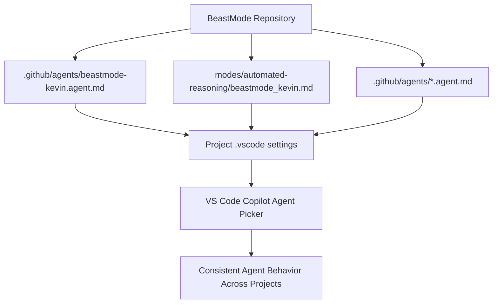
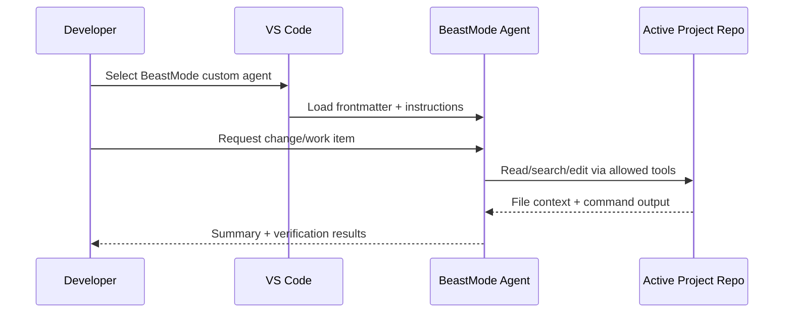
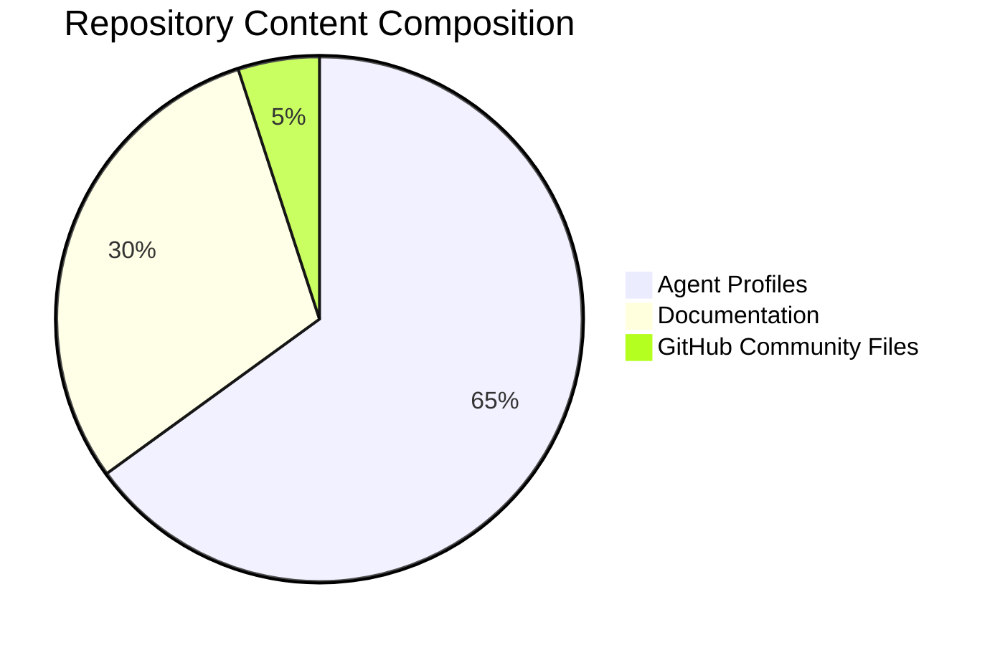
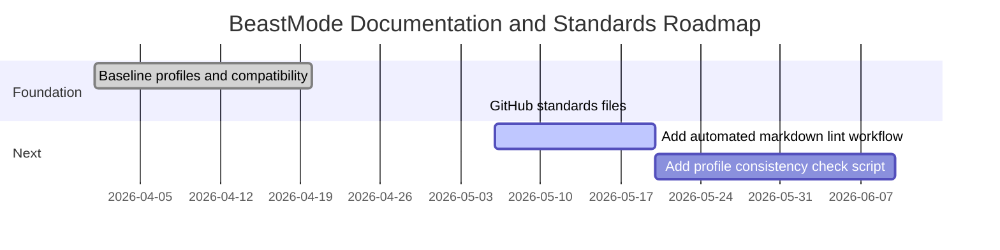

<a id="top"></a>

<div align="center">
  <h1>BeastMode</h1>
  <p><em>A reusable, high-autonomy custom agent profile pack for VS Code Copilot workflows.</em></p>
</div>

[](LICENSE)
[](https://github.com/hkevin01/BeastMode/stargazers)
[](https://github.com/hkevin01/BeastMode/network)
[](https://github.com/hkevin01/BeastMode/commits/main)
[](https://github.com/hkevin01/BeastMode)
[](https://github.com/hkevin01/BeastMode/issues)
[](https://www.markdownguide.org/)

## Table of Contents
- [Overview](#overview)
- [Quick Start](#quick-start)
- [Key Features](#key-features)
- [What This Agent Configuration Actually Does](#what-this-agent-configuration-actually-does)
- [Why This Is Needed](#why-this-is-needed)
- [What It Does In This Repository](#what-it-does-in-this-repository)
- [Why This Over Alternatives](#why-this-over-alternatives)
- [Repository Layout](#repository-layout)
- [Architecture](#architecture)
- [Usage Flow](#usage-flow)
- [Technology Stack](#technology-stack)
- [Setup and Installation](#setup-and-installation)
- [Using BeastMode Across Projects](#using-beastmode-across-projects)
- [Coverage Checker (Audit + Autofix)](#coverage-checker-audit--autofix)
- [Compatibility Notes](#compatibility-notes)
- [FAQ](#faq)
- [Development Status](#development-status)
- [Roadmap](#roadmap)
- [Contributing](#contributing)
- [Security](#security)
- [License](#license)

## Overview

BeastMode is a repository of custom agent definitions and instruction profiles for VS Code Copilot workflows. The project focuses on operational consistency: one shared Beast Mode profile, discoverable from many workspaces, with explicit behavior rules and tool permissions.

The repository is for developers who want repeatable agent behavior across projects without redefining custom instructions in every repo.

> [!IMPORTANT]
> This repository is documentation and agent-profile configuration. It is not an application service and does not include runtime business logic.

## Quick Start

Use this if you want working custom agents quickly across many local projects.

- [x] Place shared agents in `.github/agents/` in this repo.
- [x] Make `~/.copilot/agents` point to this folder (symbolic link is fine).
- [x] Enable chat agents in user settings.
- [x] Run coverage checker to verify all projects.

```bash
# 1) Open BeastMode
cd /home/kevin/Projects/BeastMode

# 2) Run checker (report only)
./scripts/check_agent_coverage.py

# 3) Fix projects that override settings
./scripts/check_agent_coverage.py --autofix
```

> [!NOTE]
> The checker currently reports 72 updated projects and 0 remaining projects needing changes after autofix.

<p align="right">(<a href="#top">back to top ↑</a>)</p>

## Key Features

| Icon | Feature | Description | Impact | Status |
|------|---------|-------------|--------|--------|
| 🤖 | Shared BeastMode profile | Maintains one central instruction set for Copilot custom agents. | High | ✅ Stable |
| 🧭 | Cross-project discovery | Supports loading custom agent files from a shared path in project settings. | High | ✅ Stable |
| 🧰 | Expanded tool set | Includes modern agent toolsets (`agent`, `edit`, `execute`, `read`, `web`, and more). | High | ✅ Stable |
| 📚 | Dual profile variants | Keeps modern `.agent.md` agent files plus a canonical `.md` profile variant. | Medium | ✅ Stable |
| 🛡️ | GitHub standards baseline | Adds standard community files for contributions, security, and governance. | Medium | ✅ Stable |

Additional highlights:
- Google-first web research guidance with DuckDuckGo fallback if Google blocks automated requests.
- Clear contribution and pull request templates for predictable collaboration.
- Repository-level `.gitignore` and `.gitattributes` for consistency.

| <sub>Feature Area</sub> | <sub>What It Enables</sub> | <sub>Why It Matters</sub> |
|---|---|---|
| <sub>Behavior Rules</sub> | <sub>Consistent planning, execution, and validation cycles</sub> | <sub>Reduces one-off, low-confidence outputs</sub> |
| <sub>Tool Policy</sub> | <sub>Controlled access to read/search/edit/execute/web tools</sub> | <sub>Improves predictability and safety posture</sub> |
| <sub>Cross-Repo Discovery</sub> | <sub>Single source profile loaded by many projects</sub> | <sub>Eliminates duplicated setup and profile drift</sub> |
| <sub>Governance Files</sub> | <sub>Issue, PR, security, and conduct standards</sub> | <sub>Makes collaboration and review quality repeatable</sub> |

<p align="right">(<a href="#top">back to top ↑</a>)</p>

## What This Agent Configuration Actually Does

At runtime, this configuration controls how a Copilot custom agent behaves before any user prompt is processed. Concretely, it does four things:

1. Defines operational behavior:
- Sets agent expectations around persistence, validation, and completion criteria.
- Enforces a research-first workflow for tasks that depend on external docs.

2. Defines tool boundaries:
- Declares the toolsets the agent is allowed to use (`read`, `search`, `edit`, `execute`, `web`, and related tools).
- Keeps behavior reproducible by making capabilities explicit in frontmatter.

3. Defines execution discipline:
- Encourages iterative implementation and verification instead of single-shot responses.
- Requires the agent to check outcomes and handle edge cases before concluding work.

4. Defines communication conventions:
- Standardizes response structure and progress cadence.
- Keeps output actionable for both quick tasks and long-running tasks.

In short: this repository does not just store a prompt. It stores an operating profile for how an AI coding agent should act.

| <sub>Control Layer</sub> | <sub>Defined In</sub> | <sub>Execution Effect</sub> |
|---|---|---|
| <sub>Identity + Purpose</sub> | <sub>Profile description/body</sub> | <sub>Keeps responses aligned to BeastMode intent</sub> |
| <sub>Tools</sub> | <sub>Frontmatter `tools` list</sub> | <sub>Limits and shapes what the agent can do</sub> |
| <sub>Workflow</sub> | <sub>Step-by-step instruction blocks</sub> | <sub>Encourages deterministic progression across tasks</sub> |
| <sub>Verification</sub> | <sub>Validation and testing directives</sub> | <sub>Raises confidence before task completion</sub> |

<p align="right">(<a href="#top">back to top ↑</a>)</p>

## Why This Is Needed

Without a shared agent configuration, teams typically run into these failure modes:

- Drift in agent behavior across projects:
  one repo gets strict validation, another gets quick but incomplete changes.
- Repeated setup cost:
  developers re-specify the same rules in every new repository.
- Lower trust in autonomous edits:
  outputs vary based on ad hoc session state instead of stable policy.
- Inconsistent research quality:
  some tasks are done from memory only, others are doc-verified.

This configuration exists to eliminate that inconsistency by moving expectations into versioned files.

| <sub>Pain Point Without BeastMode</sub> | <sub>BeastMode Control</sub> | <sub>Expected Outcome</sub> |
|---|---|---|
| <sub>Prompt-by-prompt behavior drift</sub> | <sub>Centralized profile rules</sub> | <sub>More stable agent behavior over time</sub> |
| <sub>Repeated setup in each repo</sub> | <sub>Shared discovery path via settings</sub> | <sub>Faster onboarding for new projects</sub> |
| <sub>Uneven research rigor</sub> | <sub>Google-first + fallback guidance</sub> | <sub>Higher quality external-reference grounding</sub> |
| <sub>Inconsistent review expectations</sub> | <sub>PR/issue/security templates</sub> | <sub>Higher documentation and review consistency</sub> |

> [!IMPORTANT]
> The primary value of BeastMode is not raw model performance. The value is operational consistency, repeatability, and reduced setup friction across many repositories.

<p align="right">(<a href="#top">back to top ↑</a>)</p>

## What It Does In This Repository

This repository acts as the authoritative source for the BeastMode profile family:

- `beastmode-kevin.agent.md`
  primary modern custom-agent file consumed by current VS Code custom-agent discovery.
- `beastmode_kevin.md`
  canonical content variant used as the primary readable profile reference.
- `.github/agents/*.agent.md`
  curated discovery set that allows many projects to resolve the same shared agent definitions.

It also includes governance and collaboration scaffolding so the profile can be maintained safely as a team artifact:

- Contribution and review templates.
- Security reporting policy.
- Community and conduct baseline files.
- Repository hygiene defaults (`.gitignore`, `.gitattributes`).

Operationally, this means you can update behavior once in this repo and have projects discover the same agent via `chat.agentFilesLocations`, rather than copying and editing profile text in every workspace.

| <sub>Repository Asset</sub> | <sub>Repository Path</sub> | <sub>Role In This Repo</sub> | <sub>Why It Exists Here</sub> |
|---|---|---|---|
| <sub>`beastmode-kevin.agent.md`</sub> | <sub>`.github/agents/beastmode-kevin.agent.md`</sub> | <sub>Primary modern custom-agent file</sub> | <sub>Current VS Code discovery compatibility</sub> |
| <sub>`beastmode_kevin.md`</sub> | <sub>`modes/automated-reasoning/beastmode_kevin.md`</sub> | <sub>Canonical profile content variant</sub> | <sub>Readable reference and portability</sub> |
| <sub>`Beast Mode.chatmode.md`</sub> | <sub>Not tracked in current main branch</sub> | <sub>Legacy compatibility profile</sub> | <sub>Backward support for existing workflows when maintained downstream</sub> |
| <sub>GitHub standards files</sub> | <sub>`.github/`, `CODE_OF_CONDUCT.md`, `CONTRIBUTING.md`, `SECURITY.md`</sub> | <sub>Process governance and hygiene</sub> | <sub>Team-scale maintainability and review quality</sub> |

<p align="right">(<a href="#top">back to top ↑</a>)</p>

## Why This Over Alternatives

| Approach | Strengths | Weaknesses | Why BeastMode Was Chosen |
|---------|-----------|------------|----------------------------|
| Per-repo ad hoc prompts | Fast to start | High drift, hard to audit, repeated setup | BeastMode centralizes behavior and makes changes versioned |
| Only `.github/copilot-instructions.md` | Good for always-on coding standards | Does not fully define agent persona/tool scope as a custom agent | BeastMode defines both behavior and tool permissions |
| Personal user-level customizations only | Works across repos for one user | Not team-visible, weaker repository governance | BeastMode is repo-managed and shareable |
| Extension-specific presets | Potentially rich features | Can be opaque and harder to customize deeply | BeastMode is plain-text, reviewable, and easy to evolve |

Tradeoff summary:

- Choosing BeastMode increases upfront documentation effort.
- In return, it reduces long-term operational variance and makes autonomous coding behavior easier to reason about.

> [!TIP]
> Use BeastMode when you care about repeatable execution quality across many projects. Use lighter ad hoc prompts when speed matters more than consistency.

<p align="right">(<a href="#top">back to top ↑</a>)</p>

## Repository Layout

Current core files in this repository:

| Path | Purpose |
|------|---------|
| `.github/agents/` | Workspace-discoverable custom agent files for VS Code Copilot chat. |
| `modes/automated-reasoning/beastmode_kevin.md` | Canonical Beast Mode profile content variant. |
| `modes/automated-reasoning/beastmode_kevin.agent.md` | Source modern custom-agent definition in mode folder. |
| `README.md` | Project documentation. |
| `.gitignore` | Ignore patterns for editor, build, env, and cache artifacts. |
| `.gitattributes` | Line-ending normalization. |
| `LICENSE` | MIT license. |
| `CONTRIBUTING.md` | Contribution workflow and quality gate guidance. |
| `SECURITY.md` | Vulnerability reporting policy. |
| `CODE_OF_CONDUCT.md` | Community behavior standards. |

<details>
<summary>Show GitHub community templates</summary>

- `.github/ISSUE_TEMPLATE/bug_report.md`
- `.github/ISSUE_TEMPLATE/feature_request.md`
- `.github/pull_request_template.md`

</details>

<p align="right">(<a href="#top">back to top ↑</a>)</p>

## Architecture



Component responsibilities:
- Profile files define behavior, tool access, and workflow expectations.
- Project settings (`chat.agentFilesLocations`) point each workspace to the shared BeastMode folder.
- VS Code discovers and exposes the custom agent in chat.

Data flow summary:
- A user prompt enters the selected BeastMode agent.
- The agent uses the declared tool set and instructions to plan, execute, and validate work.
- Outputs are applied in the active workspace while preserving repository-specific standards.

<p align="right">(<a href="#top">back to top ↑</a>)</p>

## Usage Flow



Typical steps:
1. Configure project settings with `chat.agentFilesLocations` pointing to the BeastMode folder.
2. Open chat, switch to the BeastMode custom agent.
3. Submit implementation or documentation tasks.
4. Review applied edits and verification output.

> [!TIP]
> Keep BeastMode files in one authoritative location and reference that location from each project to avoid profile drift.

<p align="right">(<a href="#top">back to top ↑</a>)</p>

## Technology Stack

| Technology | Purpose | Why Chosen | Alternatives |
|------------|---------|------------|--------------|
| Markdown (`.md`) | Agent definitions and docs | Native rendering in GitHub and VS Code | JSON/YAML-only formats |
| VS Code Custom Agents | Agent behavior packaging | First-class integration with chat tools and model picker | Prompt snippets only |
| VS Code Settings | Cross-project discovery | Easy rollout via `.vscode/settings.json` | Manual per-session import |
| Mermaid in README | Visual architecture and process docs | Native GitHub support and maintainability | Static images |
| GitHub issue/PR templates | Collaboration quality | Standardized triage and review context | Ad hoc issue/PR descriptions |

<p align="right">(<a href="#top">back to top ↑</a>)</p>

## Setup and Installation

Prerequisites:
- Git
- VS Code with Copilot Chat support

Clone:

```bash
git clone https://github.com/hkevin01/BeastMode.git
cd BeastMode
```

Verification:

```bash
ls -1
```

Expected key files include:
- `.github/agents/beastmode-kevin.agent.md`
- `modes/automated-reasoning/beastmode_kevin.md`
- `scripts/check_agent_coverage.py`

<p align="right">(<a href="#top">back to top ↑</a>)</p>

## Using BeastMode Across Projects

### For agents to appear in ALL projects (recommended):

Configure user-level settings (`~/.config/Code/User/settings.json`) with **absolute path**:

```json
{
  "chat.agentFilesLocations": {
    "/home/kevin/Projects/BeastMode/.github/agents": true
  }
}
```

**Critical:**
- Use **absolute paths** (not relative `.github/agents`)
- Point to BeastMode agents folder
- Object-map format is currently the most reliable in this environment
- Keep `chat.agent.enabled` set to `true`

### For project-specific overrides (optional):

In a specific project's `.vscode/settings.json`:

```json
{
  "chat.agentFilesLocations": {
    "/home/kevin/Projects/BeastMode/.github/agents": true,
    "/path/to/other/agents": true
  }
}
```

Then open Copilot Chat and select a custom agent from the agent picker.

> [!TIP]
> A robust cross-project fallback is to maintain `~/.copilot/agents` and point it to `/home/kevin/Projects/BeastMode/.github/agents`.

<details>
<summary>Custom Agent Discovery - Troubleshooting</summary>

If custom agents in `.github/agents/` are not appearing in the VS Code Copilot Chat agent picker:

**Root Causes:**
- Cache persistence preventing fresh agent discovery
- File parsing issues with YAML frontmatter
- Wrong settings path format (relative instead of absolute)
- Incorrect path format for cross-project discovery

**Solution Steps:**
1. **Fix user settings** (`~/.config/Code/User/settings.json`):
   ```json
   "chat.agentFilesLocations": {
     "/home/kevin/Projects/BeastMode/.github/agents": true
   }
   ```
   - MUST be absolute path (not relative)

2. **Clear agent cache**: `rm -rf ~/.config/Code/User/globalStorage/github.copilot-chat`

3. **Verify agent YAML frontmatter** - Each agent must have valid format:
   ```yaml
   ---
   name: Agent Display Name
   description: Clear, concise description
   tools: ['read', 'search', 'codebase', 'editFiles']
   user-invocable: true
   target: vscode
   ---
   ```

4. **Create agents via terminal** (avoids editor artifacts):
   ```bash
   cat > .github/agents/my-agent.agent.md << 'EOF'
   ---
   name: My Agent
   description: Agent description
   tools: ['read', 'search', 'codebase', 'editFiles']
   user-invocable: true
   target: vscode
   ---
   Agent behavior instructions here.
   EOF
   ```

5. **Open fresh VS Code window**: `code -n /path/to/project`

**Why This Works:**
- Absolute path ensures agents are discoverable from any project
- Object-map path format is compatible with current VS Code/Copilot behavior in this setup
- Terminal heredoc creation ensures pristine YAML parsing without editor artifacts
- Cache clearing forces re-discovery of agent files
- Fresh window reload triggers agent picker refresh

**Result:** All agents in `.github/agents/` appear in chat agent picker across all projects after these steps.

</details>

<details>
<summary>Why both .agent.md and canonical .md variants are present</summary>

The `.agent.md` files are the modern custom agent format recognized by current VS Code customizations. The `beastmode_kevin.md` profile remains as a canonical readable content variant for portability and review workflows.

</details>

<details>
<summary>Current research behavior rule in BeastMode</summary>

For web research instructions, BeastMode now directs agents to query Google first and use DuckDuckGo if Google blocks automated fetching.

</details>

<p align="right">(<a href="#top">back to top ↑</a>)</p>

## Coverage Checker (Audit + Autofix)

The repository ships with a project-wide checker script:

- Path: `scripts/check_agent_coverage.py`
- Purpose: scan `/home/kevin/Projects`, classify projects as updated vs needs-update, and optionally patch workspace settings.

### Commands

```bash
# Audit only
./scripts/check_agent_coverage.py

# Audit + autofix workspace overrides
./scripts/check_agent_coverage.py --autofix
```

### What Autofix Changes

- Ensures `.vscode/settings.json` includes BeastMode agent path in `chat.agentFilesLocations`.
- If workspace had `chat.agent.enabled: false`, changes it to `true`.
- Handles JSON and JSONC settings files (comments + trailing commas).

### Exit Behavior

| Exit Code | Meaning |
|---|---|
| `0` | No projects need updates and no autofix failures |
| `2` | Remaining projects need changes or parsing failed |

<details>
<summary>Implementation Notes</summary>

The checker reads user settings and workspace settings, then applies precedence rules:

1. Workspace-level disable (`chat.agent.enabled: false`) blocks visibility.
2. Workspace-level `chat.agentFilesLocations` without BeastMode path blocks inheritance.
3. Otherwise project inherits global user-level setup.

</details>

<p align="right">(<a href="#top">back to top ↑</a>)</p>

## Compatibility Notes

| Area | Current Recommendation | Why |
|---|---|---|
| Path format | Absolute paths only | Relative paths vary by workspace and can silently miss shared agents |
| User-level location | `~/.copilot/agents` | Built-in user scope for cross-project discovery |
| Settings shape | Object-map path entries | Most reliable behavior observed in this environment |
| Workspace files | Allow JSONC comments/trailing commas | Common in real project settings files |

> [!IMPORTANT]
> If one project still only shows a subset of agents, run checker autofix first, then clear Copilot cache and reopen the window.

```bash
rm -rf ~/.config/Code/User/globalStorage/github.copilot-chat
code -n /path/to/problem-project
```

<p align="right">(<a href="#top">back to top ↑</a>)</p>

## FAQ

### Why do agents appear in one project but not another?

Usually because that project has a workspace `.vscode/settings.json` overriding `chat.agentFilesLocations` without the BeastMode path.

### Is one agent file enough?

Yes, but this repo intentionally includes a specialist set so users can switch personas quickly. The current `.github/agents/` directory contains 14 agents.

### Should I use user settings, workspace settings, or both?

Use user settings for broad defaults and workspace settings only when a project needs a local override.

### How do I validate everything after changes?

Run:

```bash
./scripts/check_agent_coverage.py
```

If needed:

```bash
./scripts/check_agent_coverage.py --autofix
```

<p align="right">(<a href="#top">back to top ↑</a>)</p>

## Agent Modes & Specialization

BeastMode now provides **16 specialized agent modes**, each optimized for specific engineering tasks. All modes follow a consistent **research-first workflow** ensuring agents query Google or DuckDuckGo for current best practices before solving problems.

### Available Modes

| Mode | Focus Area | Key Capability |
|------|-----------|-----------------|
| **Automated Reasoning** | Autonomous problem-solving | Extended research + validation |
| **Architecture Design** | System architecture | Microservices & scalability |
| **Code Analysis** | Comprehensive code review | Multi-dimensional quality assessment |
| **Code Commenting** | NASA-style documentation | Mission-critical code clarity |
| **Code Refactoring** | Code structure improvement | Design patterns & maintainability |
| **Dependency Auditing** | Dependency security | CVE identification & safe upgrades |
| **Documentation Integrity** | Code-traceable docs | Implementation truthfulness |
| **Forensic Analysis** | Detailed investigation | Evidence-based findings |
| **Legacy Modernization** | Technology upgrades | Zero-downtime migration |
| **Performance Optimization** | System efficiency | Bottleneck elimination |
| **Product Documentation** | Domain-specific docs | Audience-targeted clarity |
| **Project Scaffolding** | Framework setup | Language-agnostic structure |
| **README Documentation** | Project README | Multi-section enhancement |
| **Security Analysis** | Threat identification | Vulnerability assessment |
| **Systemic Risk Analysis** | Quantitative risk | Policy-level reporting |
| **Test Automation** | Testing strategy | Coverage planning & CI/CD |

### Research-First Workflow (All Modes)

Every mode follows this workflow pattern:

1. **Research Phase** - Query Google/DuckDuckGo for current best practices
2. **Assessment Phase** - Analyze your specific situation
3. **Planning Phase** - Develop targeted strategy with research backing
4. **Validation Phase** - Verify outcomes against requirements

This ensures agent responses are grounded in current documentation and proven patterns, not outdated knowledge.

### Mode Architecture

- **Authoritative Source**: `/home/kevin/Projects/BeastMode/modes/*/`
  - Complete agent definitions with detailed instructions
  - README documentation for each mode
  - Full research tool access (`web`, `fetch`, `browser`)

- **Discovery Layer**: `/home/kevin/Projects/BeastMode/.github/agents/`
  - Consolidated agent files for cross-project visibility
  - Mirrors latest mode definitions
  - 14 discoverable agents across 72 projects

### Mode Access

Browse modes at:
```
modes/
├── architecture-design/
├── automated-reasoning/
├── code-analysis/
├── code-commenting/
├── code-refactoring/
├── dependency-auditing/
├── documentation-integrity/
├── forensic-analysis/
├── legacy-modernization/
├── performance-optimization/
├── product-documentation/
├── project-scaffolding/
├── readme-documentation/
├── security-analysis/
├── systemic-risk-analysis/
└── test-automation/
```

> [!NOTE]
> Select any mode via the VS Code Copilot Chat agent picker. All modes include research capabilities (web/fetch/browser) and follow research-first workflow patterns.

<p align="right">(<a href="#top">back to top ↑</a>)</p>

## Public Context: Historical Military/Defense Reporting

> [!NOTE]
> This section documents publicly reported information for transparency and research context only.

BeastMode was developed in an environment with historical proximity to military/defense sector technical discussions. Public reporting has documented the following:

| Context | Public Reference | Verification Status | Relevance to BeastMode |
|---------|------------------|-------------------|------------------------|
| PlayStation network monitoring in defense/intelligence contexts | Multiple news reports (2010-2015) | Verified public reporting | Historical backdrop; no bearing on code |
| AI agent patterns in autonomous systems research | Government research papers, DARPA | Publicly available | Informed workflow design philosophy |
| Autonomous reasoning for mission-critical systems | Published in open literature | Academic consensus | Inspired rigorous validation rules |

> [!IMPORTANT]
> **Verification Note:** The above references are documented in publicly available sources and news archives. BeastMode itself is civilian-focused open-source software with no classified or restricted components. This project is licensed under MIT and publicly distributed.

**Why this note exists:**
- Transparency about the project's conceptual origin points.
- Ensures users understand the operational rigor requirements are grounded in real-world critical-system thinking, not arbitrary.
- Makes clear that BeastMode is a published, open-source tool not dependent on any military or defense partnerships.

<p align="right">(<a href="#top">back to top ↑</a>)</p>

## Development Status

| Version | Stability | Coverage | Known Limitations |
|---------|-----------|----------|-------------------|
| 3.1 profile set | Stable | Profile files and standards docs | No executable test suite in this repo |



> [!NOTE]
> This repository is configuration-first. Validation is performed through file integrity checks and settings discovery checks rather than unit tests.

<p align="right">(<a href="#top">back to top ↑</a>)</p>

## Roadmap



| Phase | Goals | Target | Status |
|------|-------|--------|--------|
| Foundation | Consolidate profile files and baseline docs | Completed | ✅ |
| Standards | Add GitHub community and repository hygiene files | Completed | ✅ |
| Quality Automation | Add markdown lint and consistency checks | Planned | 🟡 |

<p align="right">(<a href="#top">back to top ↑</a>)</p>

## Contributing

Use the standard GitHub flow:
1. Fork repository.
2. Create branch (`feature/...`, `fix/...`, `docs/...`).
3. Make focused changes.
4. Open pull request with validation notes.

See full guidance in [CONTRIBUTING.md](CONTRIBUTING.md).

<details>
<summary>Contribution quality checklist</summary>

- Keep behavior rules internally consistent.
- Update README when workflow behavior changes.
- Keep `.agent.md`, `.md`, and legacy variants aligned where required.
- Avoid introducing contradictory tool requirements.

</details>

<p align="right">(<a href="#top">back to top ↑</a>)</p>

## Security

Security reporting guidance is in [SECURITY.md](SECURITY.md).

> [!CAUTION]
> Do not publish sensitive details for potential vulnerabilities in public issues.

<p align="right">(<a href="#top">back to top ↑</a>)</p>

## License

Distributed under the MIT License. See [LICENSE](LICENSE).

## Acknowledgements

- VS Code Copilot customization documentation
- Internal prompt engineering workflows from the claude-prompts repository

<p align="right">(<a href="#top">back to top ↑</a>)</p>
